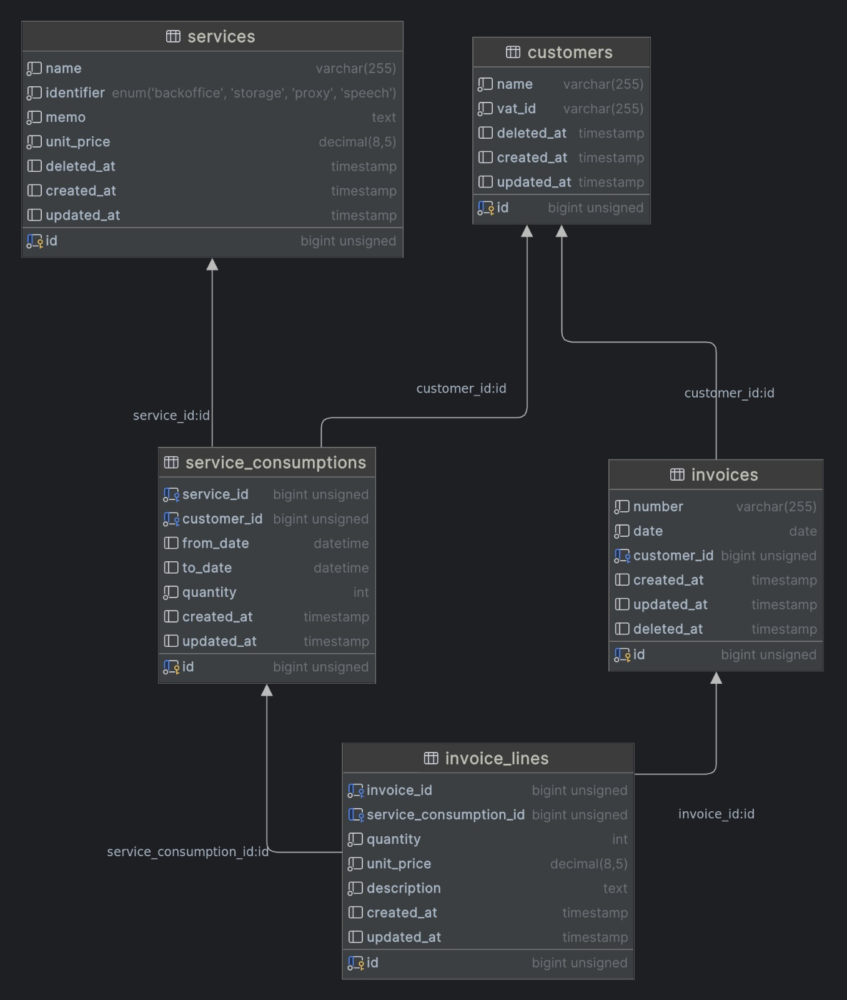

## Service consumption and invoice management API

### About this project

With this app you can manage customers, service consumption and invoices.

Through migrations you will obtain some fake entities to generate your first invoice.

The relationships between each entity are defined by the following class diagram:

<p style="text-align: center">

</p>


### About Development 
The application is written on Laravel + Sail to have a dockerized development environment in a very short time. 
DB engine is Mysql in two separate instances (application and testing)

Algunos principios SOLID fueron aplicados como por ejemplo en el commit bd44cf67, Single Responsibility Principle

Factories and seeders were used to create initial data.

Tests were developed based on api routes to check main flow.

### Invoice totals calculation

For each detail of invoice, the strategy to find subtotal was simple as: `quantity * unit_price`.
The thing is when you have to deal with more variables, like Storage service, where you have to
bill service usage depends on `storage amount`, `storage time` and `unit_price`. 

So the resolution was store in consumption table, 
the quantity of GB in `quantity` and period in `from_date` and `to_date`, so when you 
want to bill this consumption, quantity in invoice detail represents `GBs * days`.

You can find unit_price in both `services` and `invoice_details` tables to save service price from the exact moment 
when you create the invoice.


### How to install

You only few dependencies:  php, composer, docker and docker-compose to start the application:

```
### first clone the repo
git clone https://github.com/colomuller91/tenet-api-test.git    

### move to the project folder and install dependencies
cd tenet-api-test
composer install

### copy env
cp .env.example .env

### install sail, only need to include mysql service for this application
php artisan sail:install

### (optional) add sail command as an alias, in this case is for zsh bash
echo 'alias sail="./vendor/bin/sail"' >> ~/.zshrc

### start the application
sail up -d

### generate key
sail artisan key:gen

### insert initial data
sail artisan migrate --seed

### if you want to start over with another random data
sail artisan migrate:fresh --seed

### run tests (test are running in testing instance db, so your main db instance is safe :)
sail artisan test

```


### Application endpoins

You can list all app endpoints using `artisan` command

```
sail artisan route:list --path=api
```

Also, a <b>postman collection</b> is in root folder of project

Laravel is a web application framework with expressive, elegant syntax. We believe development must be an enjoyable and creative experience to be truly fulfilling. Laravel takes the pain out of development by easing common tasks used in many web projects, such as:

- [Simple, fast routing engine](https://laravel.com/docs/routing).
- [Powerful dependency injection container](https://laravel.com/docs/container).
- Multiple back-ends for [session](https://laravel.com/docs/session) and [cache](https://laravel.com/docs/cache) storage.
- Expressive, intuitive [database ORM](https://laravel.com/docs/eloquent).
- Database agnostic [schema migrations](https://laravel.com/docs/migrations).
- [Robust background job processing](https://laravel.com/docs/queues).
- [Real-time event broadcasting](https://laravel.com/docs/broadcasting).

Laravel is accessible, powerful, and provides tools required for large, robust applications.

## Learning Laravel

Laravel has the most extensive and thorough [documentation](https://laravel.com/docs) and video tutorial library of all modern web application frameworks, making it a breeze to get started with the framework.

You may also try the [Laravel Bootcamp](https://bootcamp.laravel.com), where you will be guided through building a modern Laravel application from scratch.

If you don't feel like reading, [Laracasts](https://laracasts.com) can help. Laracasts contains thousands of video tutorials on a range of topics including Laravel, modern PHP, unit testing, and JavaScript. Boost your skills by digging into our comprehensive video library.

## Laravel Sponsors

We would like to extend our thanks to the following sponsors for funding Laravel development. If you are interested in becoming a sponsor, please visit the [Laravel Partners program](https://partners.laravel.com).

### Premium Partners

- **[Vehikl](https://vehikl.com/)**
- **[Tighten Co.](https://tighten.co)**
- **[WebReinvent](https://webreinvent.com/)**
- **[Kirschbaum Development Group](https://kirschbaumdevelopment.com)**
- **[64 Robots](https://64robots.com)**
- **[Curotec](https://www.curotec.com/services/technologies/laravel/)**
- **[Cyber-Duck](https://cyber-duck.co.uk)**
- **[DevSquad](https://devsquad.com/hire-laravel-developers)**
- **[Jump24](https://jump24.co.uk)**
- **[Redberry](https://redberry.international/laravel/)**
- **[Active Logic](https://activelogic.com)**
- **[byte5](https://byte5.de)**
- **[OP.GG](https://op.gg)**

## Contributing

Thank you for considering contributing to the Laravel framework! The contribution guide can be found in the [Laravel documentation](https://laravel.com/docs/contributions).

## Code of Conduct

In order to ensure that the Laravel community is welcoming to all, please review and abide by the [Code of Conduct](https://laravel.com/docs/contributions#code-of-conduct).

## Security Vulnerabilities

If you discover a security vulnerability within Laravel, please send an e-mail to Taylor Otwell via [taylor@laravel.com](mailto:taylor@laravel.com). All security vulnerabilities will be promptly addressed.

## License

The Laravel framework is open-sourced software licensed under the [MIT license](https://opensource.org/licenses/MIT).
